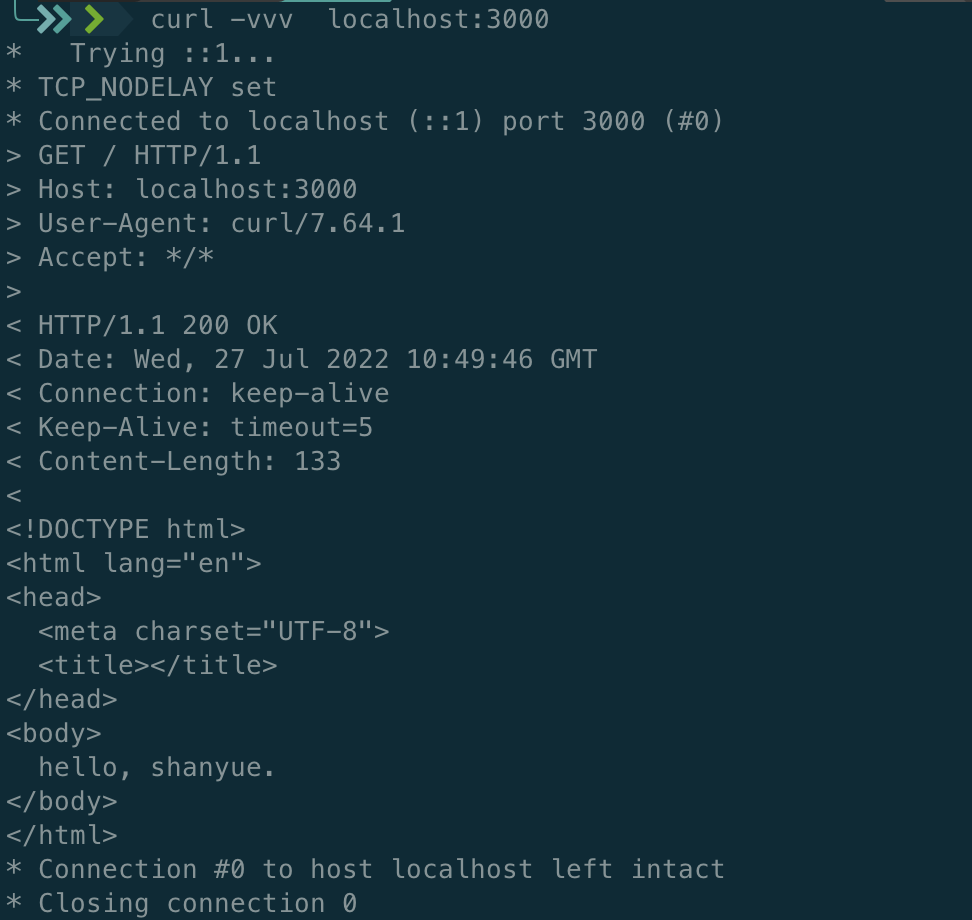
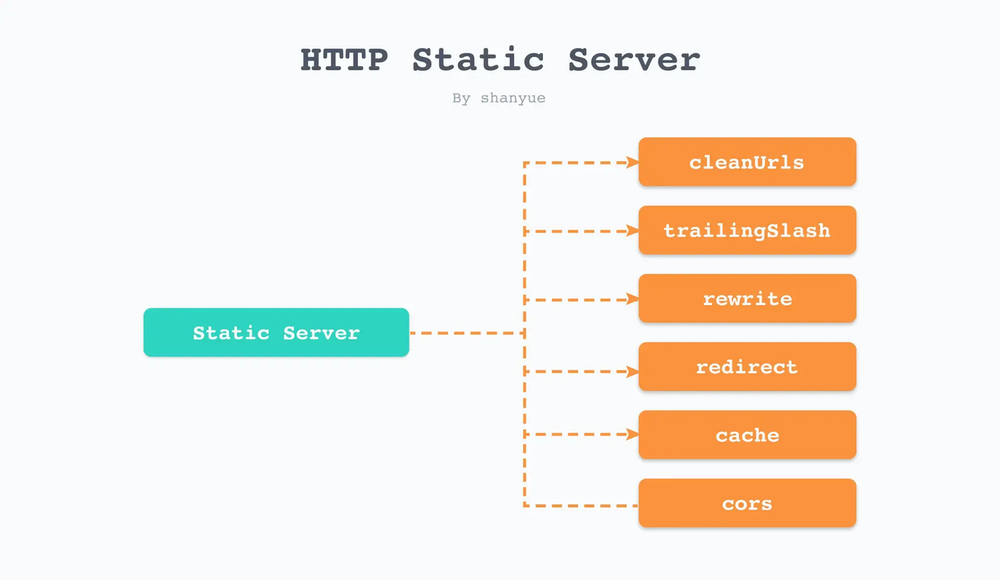
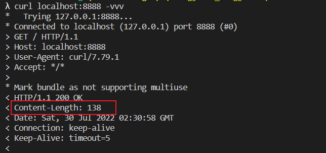
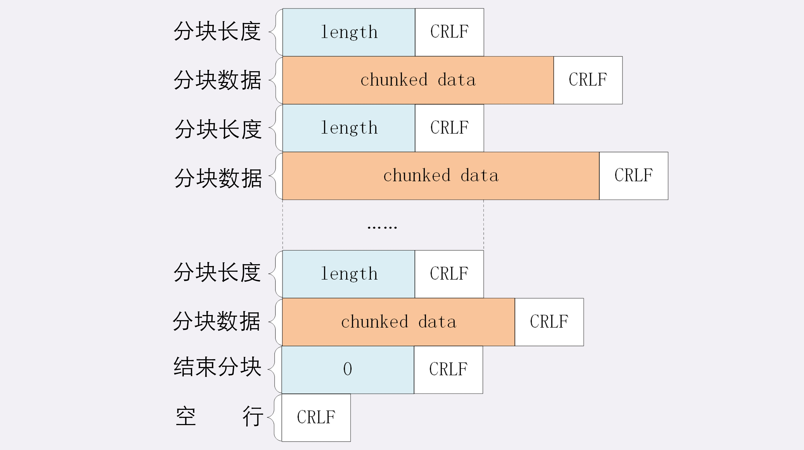
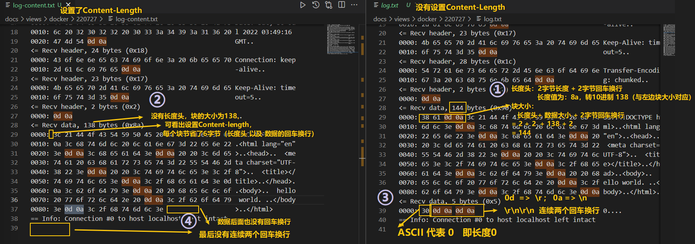

## 总结
1. nginx 
  - 可以快速搭建一个静态资源服务器。
  - 通过简单的配置可以实现反向代理 负载均衡等基础功能，不需要额外开发。
  - 底层用 C 进行编写，性能比 JS 强。
  - 应用 - 反向代理：为用户降低负担，免记端口号。
  - 应用 - rewrite：实现单页面应用访问任意 *.html 都读取根目录 index.html。


2. docker 
  - 环境隔离
  - 每个项目运行在自己的容器中，不会相互影响
  - 环境配置过程简单
  - 在迁移服务器的时候极为方便
  - 多项目服务器上，自由和灵活度大大提升


3. 主动设置 `Content-Length` 可以减少传输内容，提高性能。 


## 1. 为什么要从简单的静态资源服务器，开始学习docker
从最简单的 Node 静态资源服务器中，可以了解 Node 静态资源服务器的实现和弊端。从而真实地感知到 nginx 和 docker 具有什么优势，解决了哪些问题，


## 2. 静态资源服务器
首先需要了解概念，什么是静态资源服务器？     
静态资源服务器：不会被服务器的动态运行所改变或者生成的文件———称为静态资源，而可以对客户端的请求进行响应并返回这些静态资源的服务，称为静态资源服务器。     
动态资源服务器：与静态相对，动态资源需要根据客户端的请求，并动态生成对应的资源，将这些资源响应给客户端的服务称为动态资源服务器。     
两者的区别：资源一开始便存在，不需要查数据库也不需要程序处理，满足为静态资源，否则动态。


## 3. Node 静态资源服务器
Node 因为 JavaScript 的原因和前端最为贴合，所以优先考虑学习成本最低的 Node 来搭建一个静态资源服务器。  

实现一个响应 HTML 文件的服务器
```javascript
// server-fs.js
const http = require('node:http')
const fs = require('node:fs')

// 上段代码这里是一段字符串，而这里通过读取文件获取内容
const html = fs.readFileSync('./index.html')

const server = http.createServer((req, res) => res.end(html))
server.listen(3000, () => {
  console.log('Listening 3000')
})
```
步骤：
1. 引入内置模块(builtinModule) `node:fs`。
2. 使用 fs 模块的 `fs.readFileSync` 方法读取静态资源。
3. 引入内置模块 `node:http` 。
4. 使用 http 模块的 `http.createServer` 方法创建服务。并指定使用 `res.end(html)` 设置响应体为上方的静态资源。
5. 使用服务的 `server.listen` 监听指定端口。 
> `node:` 前缀见官方文档 [core-modules](https://nodejs.org/api/modules.html#core-modules)，需升级 node 版本号至 v14.18.0 及以上


执行 `node server-fs.js` 一个简单的 node 静态服务器就启动了。

通过 `curl -vvv localhost:3000` 可获得报文信息进行验证，效果如下，可以看到已经可以响应 HTML 文件了。




## 4. 为什么需要专业的静态资源服务器
既然能够利用 Node 写静态服务器，为什么要需要专业的静态资源服务器。因为手写服务器有以下缺点.
### 4.1 开发效率低
开发效率低，一个静态资源服务器要实现的基础功能有很多。例如 Rewrite、Redirect 都需要重新开发。


Rewrite 场景:
1. 单页应用的所有 `*.html` 均为读取根目录 index.html。
2. vuepress 等静态网站生成器将会有 .html 后缀，此时可通过 Rewrite 去除后缀。比如，将 /hello 重写到 /hello.html。(去除后缀名的功能也叫 cleanUrls，vercel)


### 4.2 性能低
```javascript
// 读取整个文件再返回，性能低
const html = fs.readFileSync('./index.html')
const server = http.createServer((req, res) => res.end(html))


// 通过 fs.createReadStream，提升该静态服务器的性能
const server = http.createServer((req, res) => {
  // 此处需要手动处理下 Content-Length
  fs.createReadStream('./index.html').pipe(res)
})
```
进行优化:    
`fs.readFileSync`：需要将文件内容整块读入内存中，再进行发送。    
`fs.createStream`：基于流读多少发多少，分块发送，响应更快。存在缓冲，从而避免短时间内大量数据占用内存导致问题。替换 fs.readFileSync 方法。     

即使可以有这些优化，但 Javascript 性能有限，使用 nginx 作为静态资源服务器拥有更高的性能。    


## 5.初步认识 nginx、docker 
在上面我们可以启动一个静态服务，并且监听指定端口。但是如果一个服务器有许多项目，不同项目的服务监听不同的端口，用户访问不同项目就需要敲入不同端口号。

用户需要记住端口号，这个负担很沉重。通过 nginx 进行反向代理后，可以通过二级域名或者路由，直接访问不同的项目。而且 nginx 提供了许多静态服务器需要的基础功能，大大提高了开发效率。

不同的项目需要不同的环境，可能是不同语言，如 Java、Node、GO编写的，甚至同个语言下的不同版本如 Node。这些环境的配置相当繁琐，在系统迁移的时候也十分麻烦，docker 可以启动一个容器和宿主环境隔离开来，每个项目运行在自己的容器中，自由和灵活度大大提升。


## 6. 扩展
### 6.1 为什么基于 stream 的静态服务器拥有更高的性能？   
`fs.readFile`：一次性读取，需要将文件内容完整读入内存中，才能进行传输。占用内存大，且读取过程中的时间浪费了。    
  
`fs.createStream`：基于流 stream 的静态服务器，将文件分成多个数据块进行读取，已读的数据可以立即进行传输，不用再等待整个文件读取完，响应更快。存在缓冲，避免占用太大内存。

### 6.2 为什么基于 stream 后，serve 等静态资源服务器仍然会计算 Content-Length？
1. 先说结论     
  目的：减少传输内容，提高性能。   
  设置 `Content-Length` 能减少传输内容，文件大小仅仅只要被分成 3 个块，传输内容就会减少。

2. 实现：    
`fs.stat` 方法可获取文件的信息，其中的 `size` 属性为文件大小，可以将其设置在响应头 `Content-Length` ，后续使用
`createReadableStream` 创建一个可读流并传输给客户端。
    ```javascript
    const http = require('http')
    const fsp = require('fs/promises')
    const fs = require('fs')
    const server = http.createServer(async (req, res) => {
      const stat = await fsp.stat('./index.html')
      res.setHeader('Content-Length', stat.size)
      fs.createReadStream('./index.html').pipe(res)
    })
    const port = 8888
    server.listen(port, () => {
      console.log(`Listening ${port}`)
    })
    ```
   
   
2. 为什么要在响应头返回 Content-Length：     
  - 不设置 `Content-Length` ：http 响应报文的 会有 `Transfer-Encoding: chunked`  响应头。    
    
    
    该响应头告知浏览器，响应的正文不是一次性传输，而是分成一个个快（chunk）。    
    每个 chunk ：    
    - length（长度） + \r\n（换行标志）
    - chunk data（数据包） + \r\n（换行标志）    
  

    连续两个换行代表结束：按照规定，结束的时候发送结束分块，长度头值为0，分块数据没有内容。看上去便是连续两个换行。

  - 设置了 `Content-Length`：stream 还是以分块的形式传输，但是没有 长度头，分块数据也没有回车换行 。当客户端读取 Content-length 的值大小的资源时，表示数据接收完毕。

      
  理论图
    

  实际测试图
  

  设置了 Content-Length
  - 每个块将省去 长度头（2字节长度值，2字节回车换行） 和 数据后的回车换行（2字节），总共 6 个字节。
  - 省去最后的结束分块和空行（1字节长度值，4字节回车换行），总共 5 字节。
  - 省去 `Transfer-Encoding: chunked.` 响应头：总共 28 字节
  - 多了 `Content-Length:` 和 长度值字节： 总共 16 字节 + 长度值字节    

  ```sh
  验证加了Content-Length，是否一定减少传输内容。

  做个简单的计算：假设分成 1 块，因为分块越多（每块减6字节），传输内容减少越多，我们以影响最小的计算。     

    - 6 - 5 - 28 + 16 + 长度值字节 
  =  长度值字节 - 23 
  如果结果小于0，则证明传输内容减少
  即   长度值字节 < 23 字节  传输内容减少

 长度值代表这个包的大小，这个值完完全全够不到 23 字节，23 字节可以表示一个天文数字了。
  ``` 

  所以设置 `Content-Length` 就能够减少传输内容。

  > 使用curl --trace log.txt localhost:8888 可以转储所有传入和传出的数据到文件，包括描述信息。

    

  为了提高效率 更好 还是使用压缩 nginx gzip on 压缩 text/html 文本


### 6.3 继续完善静态服务器，使其作为一个命令行工具，支持指定端口号、读取目录、404、stream (甚至 trailingSlash、cleanUrls、rewrite、redirect 等)。可参考 serve-handler。


### 6.4 什么是 rewrite 和 redirect？
在客户端请求的资源不在本服务器的情况下
- rewrite：内部重定向，服务器去目标服务器获取资源，获取到资源后响应给客户端。客户端只需要发送 1 个请求就可以获取到资源。
- redirect：重定向，服务器通过 301/302 状态码，将资源地址存放在Location 响应头告知客户端，客户端再发送请求去获取资源。客户端需要发送 2 个请求才可以获取到资源。


## 疑问


个人github：[**https://github.com/zhengjiabo**](https://github.com/zhengjiabo) 