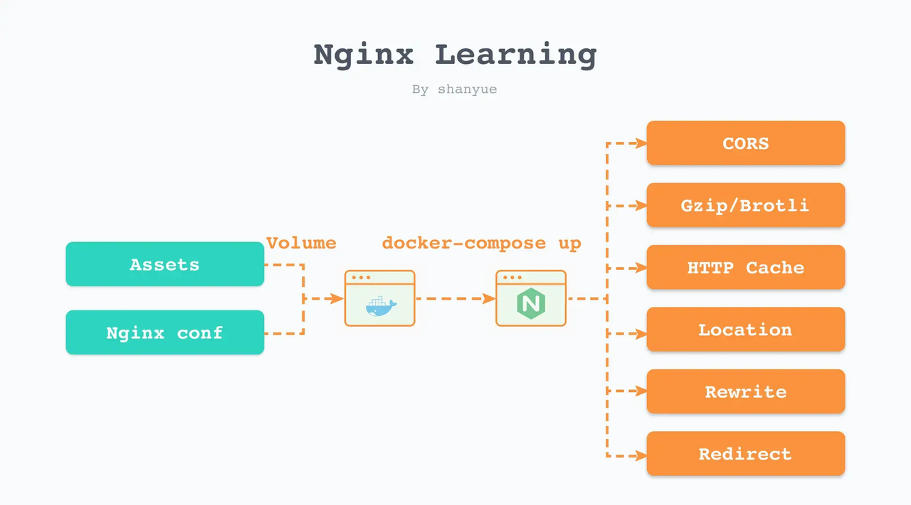

## 总结


## 1. nginx 配置文件
nginx 配置文件在 `/etc/nginx/` 目录中

### 1.1 /etc/nginx/nginx.conf
nginx 主要配置文件，引用了 `/etc/nginx/conf.d/` 目录下的所有配置文件
```nginx
user  nginx;
worker_processes  auto;

error_log  /var/log/nginx/error.log notice;
pid        /var/run/nginx.pid;


events {
    worker_connections  1024;
}


http {
    include       /etc/nginx/mime.types;
    default_type  application/octet-stream;

    log_format  main  '$remote_addr - $remote_user [$time_local] "$request" '
                      '$status $body_bytes_sent "$http_referer" '
                      '"$http_user_agent" "$http_x_forwarded_for"';

    access_log  /var/log/nginx/access.log  main;

    sendfile        on;
    #tcp_nopush     on;

    keepalive_timeout  65;

    #gzip  on;

    # 引用了 `/etc/nginx/conf.d/` 目录下的所有配置文件
    include /etc/nginx/conf.d/*.conf;
}
```


### 1.2 /etc/nginx/conf.d/default.conf
nginx 的默认配置
```nginx
server {
    listen       80;
    server_name  localhost;

    #access_log  /var/log/nginx/host.access.log  main;

    location / {
        root   /usr/share/nginx/html;
        index  index.html index.htm;
    }

    #error_page  404              /404.html;

    # redirect server error pages to the static page /50x.html
    #
    error_page   500 502 503 504  /50x.html;
    location = /50x.html {
        root   /usr/share/nginx/html;
    }

    # proxy the PHP scripts to Apache listening on 127.0.0.1:80
    #
    #location ~ \.php$ {
    #    proxy_pass   http://127.0.0.1;
    #}

    # pass the PHP scripts to FastCGI server listening on 127.0.0.1:9000
    #
    #location ~ \.php$ {
    #    root           html;
    #    fastcgi_pass   127.0.0.1:9000;
    #    fastcgi_index  index.php;
    #    fastcgi_param  SCRIPT_FILENAME  /scripts$fastcgi_script_name;
    #    include        fastcgi_params;
    #}

    # deny access to .htaccess files, if Apache's document root
    # concurs with nginx's one
    #
    #location ~ /\.ht {
    #    deny  all;
    #}
}
```


### 1.3 /usr/share/nginx/html
默认的静态文件资源，nginx 的欢迎页。


## 2. 通过 docker 学习 nginx
      
通过 `volumes` 挂在当前目录资源，以及 nginx 配置文件。可以分模块快速验证 nginx 配置。      
？？？？

- root：静态资源的根目录，默认 `/usr/share/nginx/html`
- index：当请求路径以 `/` 结尾时，自动寻找该路径下的 index 文件。
- default_type：默认 `content-type` 类型

- locatiion 中的配置
  - add_header：添加响应头，一般用X-作为自定义头部 
  - try_files：尝试匹配文件，$uri 代表路由


结论：
1. 使用 `try_files` 本质上也是去访问路由。      
```nginx
location / {
  expires -1;

  add_header X-Config A;

  try_files  $uri $uri.html $uri/index.html /index.html;
}

location /base {
  expires -1;

  add_header X-Config B;

  try_files $uri /index.html;
}
  
location /plus {
  expires -1;

  add_header X-Config C;

  try_files $uri /base;
}
```
访问 `curl --head http://localhost:8210/plus` 会得到

```bash
HTTP/1.1 200 OK
Server: nginx/1.23.1
Date: Thu, 04 Aug 2022 16:08:24 GMT
Content-Type: text/html
Content-Length: 166
Last-Modified: Thu, 04 Aug 2022 13:36:14 GMT
Connection: keep-alive
ETag: "62ebcb4e-a6"
Expires: Thu, 04 Aug 2022 16:08:23 GMT
Cache-Control: no-cache
X-Config: A
Accept-Ranges: bytes
```
访问了 `/plus` 尝试访问 `/base` 再尝试访问 `/` 最后携带 `X-Config: A` 即命中了 `/`

2. 即使删掉 `location /` 和 404 路由，也默认有。


## 3. location 匹配路由
修饰符，按以下优先级依次递减。
1. `=`：精确匹配
2. `^~`：前缀匹配，同样的前缀匹配，走最长路径
3. `~`：正则匹配，优先级再次 (如果是 `~*` 不区分大小写，与此归为同一类)。如果同样是正则匹配，走第一个路径。
4. `/`：通用匹配，匹配最长的

走相关路由，如果相关路由内没有相关资源，中断跳出走 404。     


## 4. 应用场景
1. 协商缓存
设置 `expires -1;`        
响应头返回 
```bash
Cache-Control: no-cache # 每次请求都需要向服务器校验
ETag: $token  # 后面用于 If-None-Match 校验，基于资源的内容编码生成一串唯一的标识字符串，只要内容不同，就会生成不同的 ETag。
Last-Modified：$Mtime # 后面用于 If-Modified-Since 校验。如果校验后没过期，返回 304，并重新设置超时时间。
```

2. 强缓存：浏览器不会像服务器发送任何请求，直接从本地缓存中读取文件并返回
设置 `expires 3d;` 表示 3 天内不会过期，直接使用浏览器缓存            
响应头返回
```bash

Date: Thu, 04 Aug 2022 14:29:56 GMT # 服务器当前时间，如果需要缓存，会以此时间添加缓存时间，放在Expires 里。
Cache-Control: max-age=259200 # 3天转成259200秒，优先级比 Expires 高，超过这个时间会向服务器发起请求。
Expires: Tue, 02 Aug 2022 23:56:36 GMT # 3 天后的时间，超过该事件会向服务器发起请求
ETag: $token  # 后面用于请求头的 If-None-Match 校验，如果校验后没过期，返回 304，并重新设置超时时间。优先级高于 Last-Modified。
Last-Modified：$Mtime # 后面用于 If-Modified-Since 校验。如果校验后没过期，返回 304，并重新设置超时时间。

```


3. cleanUrls 访问路径时，可以省略 .html

设置 `try_files  $uri $uri.html $uri/index.html /index.html;`       
会按以上顺序去依次匹配文件，其中就包括了后面补全的 .html 和 $url/index.html，如果都匹配不到便跳回主页面 /index.html。单页应用可以以此跳回。          
   


## 疑问
1. 在容器内部的 ngixn 配置中，可以通过 http://api 去访问另一个容器里的服务？api 是服务名。 而且是是通过 3000 端口使用 api，而不是宿主端口 8888。
猜测容器内可以通过 http//服务名 相互访问，且直接使用容器内端口。     
如果我宿主机起了个服务，在容器内，如何通过proxy_pass设置访问

2. yaml 的 version 3  是什么意思
3. 即使删掉 `location /` 和 404 路由，也默认有？


个人github：[**https://github.com/zhengjiabo**](https://github.com/zhengjiabo) 