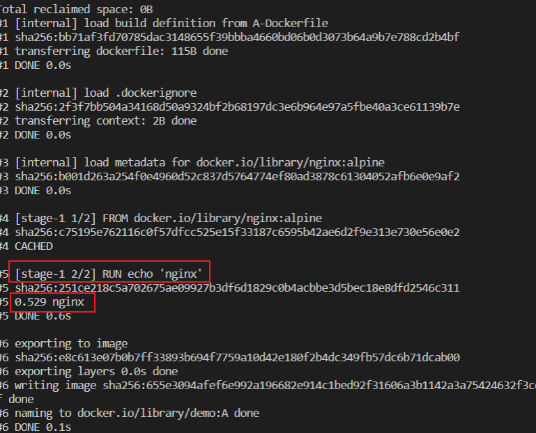
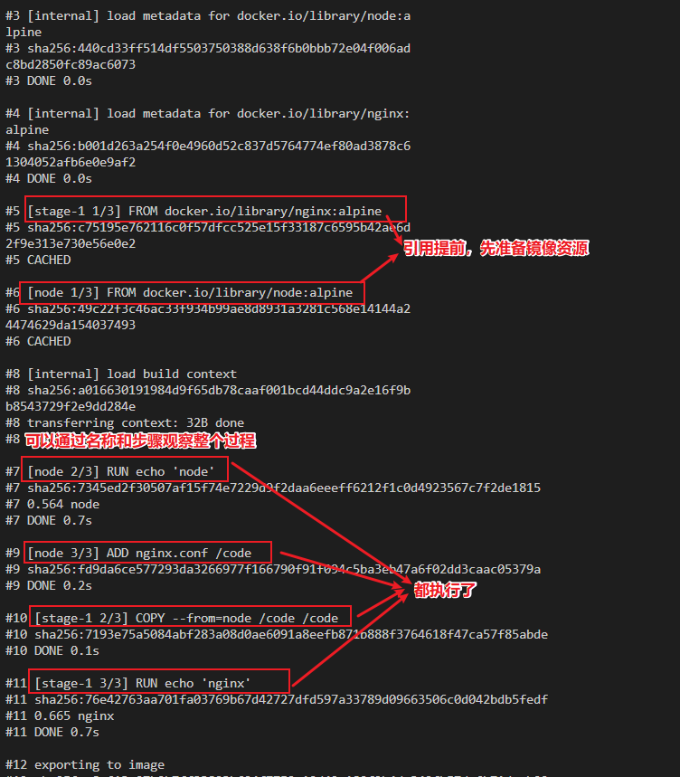

## 总结
1. 构建缓存（节省时间）：在 docker 中，上一层的内容没有修改，这一层的命令又和之前的命令一样，那么判断可利用缓存，这便是构建缓存。所以前端项目构建的时候，会把 `package.json/yarn.lock` 单独抽离形成一个层，完全避开代码的影响，从而对依赖包使用缓存，这也是对 `npm i / yarn` 的优化              
2. 多阶段构建（节省空间）：由于前端需要 node 环境进行打包，所以第一阶段必须引入 node 镜像（体积大），但打包完取得静态资源文件后，便不需要 node 环境了，因为 nignx 的占用空间和性能方面具有更大的优势，所以第二阶段引入 nginx 镜像（体积小），进行静态资源服务化。        
3. 多阶段构建的场景：     
   - 节省空间，缩小镜像体积。
   - 将复杂的操作封装成镜像，便于后续使用，例如 nginx 上的 brotli，封装好了直接引入镜像即可。  
4. 只要代码 和 命令无变化，便会命中缓存。根据这个思路，我们需要尽可能更细化地提交代码，当前阶段需要什么资源就提交什么，绝不多提。
   1. `package.json/yarn.lock` 单独抽离形成一个层，完全避开代码的影响
   2. 将打包所需要代码单独抽离形成一个层，避免 `readMe.md/nginx.conf` 等文件的影响。
   3. 引用 nignx 镜像后，再添加 `nginx.conf`。
   4. 不要使用 `ADD .` ，即不引用多余资源，尽可能使用构建缓存。
5. FROM 多个使用上的区别
   1. 单纯的使用多个 FROM，只有最后一个 FROM 后面的指令起效。
   2. 使用 `FROM as <name>`，并在后续的 `FROM` 使用或者使用 `COPY --from=<name>`，都会执行。     


## 1. SPA 单页应用部署


node 单页应用部署：
1. 构建：`npm run build` 获得 `/build` 或 `/dist`。
2. 执行 `npx serve -s build`，使用开源库 serve 启动服务。      
 
翻译成 Dockerfile
```dockerfile
FROM node:14-alpine

WORKDIR /code

ADD . /code
RUN yarn && npm run build

CMD npx serve -s build
EXPOSE 3000
```

以上构建完成，项目可以正常部署，但有以下两点问题
1. 构建镜像时间过长，需要优化构建时间。
2. 构建镜像文件过大，需要优化镜像体积。


## 2. 构建时间优化：构建缓存
前端项目耗时主要集中在两个命令
1. npm i (yarn)
2. npm run build

本地中，如果 package 中没有新的依赖，不需要重新安装依赖。Docker 中，也可以做到这一点。      
在 Dockerfile 中，对于 `ADD` 指令（[官方文档](https://docs.docker.com/engine/reference/builder/#add)）来讲，如果添加文件内容的 `checksum` 没有发生变化，则可以利用构建缓存（[Best practices for writing Dockerfiles](https://docs.docker.com/develop/develop-images/dockerfile_best-practices/#leverage-build-cache)）。      

前端项目中，如果 `package.json/yarn.lock` 没有变更，那么无需执行 `npm i / yarn`。
```dockerfile
FROM node:14-alpine as builder

WORKDIR /code

# 单独分离 package.json，是为了安装依赖可最大限度利用缓存
ADD package.json yarn.lock /code/

# 上一层的内容没有修改，这一层的命令又和之前的命令一样，那么判断可利用缓存。在 RUN yarn 时也利用该层的缓存，不会实际重新执行依赖安装。
# 单独抽离 package.josn 是为了尽可能减少该层被更改的几率，从而可以利用缓存
RUN yarn


# 假设项目文件都没有修改，那么ADD . /code会利用缓存， build 也会利用缓存。
ADD . /code
RUN npm run build

CMD npx serve -s build
EXPOSE 3000
```

> 镜像是一层一层构建的，如果上一层的内容没有修改，这一层的命令又和之前的命令一样，那么判断可利用缓存。

进行构建时，若可利用缓存，可看到 `CACHED` 标记。
```bash
$ docker-compose up --build
...
 => CACHED [builder 2/6] WORKDIR /code                                                                            0.0s
 => CACHED [builder 3/6] ADD package.json yarn.lock /code/                                                        0.0s
 => CACHED [builder 4/6] RUN yarn                                                                                 0.0s
...
```


## 3. 构建体积优化：多阶段构建

### 3.1 多阶段构建介绍
静态资源服务器 nginx 的占用空间小、性能优势比 node 强许多。         
我们的目的是通过 node 执行打包，获取静态资源，使用 nginx 对静态资源进行服务化。       

完全不需要依赖于 node.js 环境进行服务化。node.js 环境在完成构建，提供静态资源后，就完成了它的使命，它的继续存在会造成极大的资源浪费。

所以可以使用多阶段构建进行优化，最终使用 nginx 进行服务化。
1. 第一阶段 Node 镜像：使用 node 镜像对单页应用进行构建，生成静态资源。
2. 第二阶段 Nginx 镜像：使用 nginx 镜像对单页应用的静态资源进行服务化。
```dockerfile
FROM node:14-alpine as builder

WORKDIR /code

# 单独分离 package.json，是为了安装依赖可最大限度利用缓存
ADD package.json yarn.lock /code/
RUN yarn

ADD . /code
RUN npm run build

# 选择更小体积的基础镜像
FROM nginx:alpine

# 从之前的镜像中，获取静态资源文件
COPY --from=builder code/build /usr/share/nginx/html
```
`FROM [--platform=<platform>] <image> [AS <name>]` 参考[文档](https://docs.docker.com/engine/reference/builder/#from)
- platform：指定不同驱动，例如 `linux/amd64, linux/arm64, or windows/amd64`
- as：自定义别名，用于后续的 FROM 或者 `COPY --from=<name>`。

单纯使用 node 镜像，和使用多阶段构建后最终使用 nginx 镜像，镜像大小相差 **20** 倍。可见使用 nignx 作为静态服务器和多阶段构建的重要性。      


### 3.2 多阶段构造的应用
只要代码 和 命令无变化，便会命中缓存。根据这个思路，我们需要尽可能更细化地提交代码，当前阶段需要什么资源就提交什么，绝不多提。
1. `package.json/yarn.lock` 单独抽离形成一个层，完全避开代码的影响
2. 将打包所需要代码单独抽离形成一个层，避免 `readMe.md/nginx.conf` 等文件的影响。
3. 引用 nignx 镜像后，再添加 `nginx.conf`。
4. 不要使用 `ADD .` ，即不引用多余资源，尽可能使用构建缓存。


```dockerfile
FROM node:14-alpine as builder

WORKDIR /code

# 单独分离 package.json，是为了 yarn 可最大限度利用缓存
ADD package.json yarn.lock /code/
RUN yarn

# 不使用 ADD . /code
# 单独分离 public/src，是为了避免 ADD . /code 时，因为 Readme/nginx.conf 的更改避免缓存生效
# 也是为了 npm run build 可最大限度利用缓存
ADD public /code/public
ADD src /code/src
RUN npm run build

# 选择更小体积的基础镜像
FROM nginx:alpine
# 
ADD nginx.conf /etc/nginx/conf.d/default.conf
COPY --from=builder code/build /usr/share/nginx/html
```


### 3.3 FROM 多个使用上的区别
1. 单纯的使用多个 `FROM`     
    结论：只有最后一个 `FROM` 后面的指令起效。
    ```dockerfile
    # A-Dockerfile
    FROM node:alpine

    RUN echo 'node'

    FROM nginx:alpine

    RUN echo 'nginx'
    ```
    执行 `docker image prune -f && docker build -t demo:A --progress plain -f A-Docckerfile .`

    

2. 使用 `FROM as <name>`，并在后续的 `FROM` 使用或者使用 `COPY --from=<name>`        
   结论：都会执行

   `FROM`     
   ```dockerfile
    # A-Dockerfile
    FROM node:alpine as node

    RUN echo 'node'

    # 跟我们引用公共基础镜像 或 自己的自定义镜像一样，有点继承的思维。
    # 在后续镜像中，依然能使用 node 命令，本质还是 node 镜像
    FROM node

    RUN echo 'nginx'
   ```
   执行 `docker image prune -f && docker build -t demo:A --progress plain -f A-Docckerfile .`     
   


    `COPY --from=<name>`
   ```dockerfile
    # A-Dockerfile
    FROM node:alpine as node

    RUN echo 'node'
    # 这里是随便找点文件提交，演示 COPY --from
    ADD nginx.conf /code 

    # node 镜像的工作已经结束了。
    # 后续不能使用 node 命令，因为已经被 nginx 镜像替代了。
    FROM nginx:alpine
    COPY --from=node /code /code

    RUN echo 'nginx'
    # 如果执行以下指令会报错
    # RUN node -v 
   ```
   执行 `docker image prune -f && docker build -t demo:A --progress plain -f A-Docckerfile .`      
   


## 疑问
- [x] FROM node:14-alpine as builder。`as builder` 是什么意思？ 文中解答了
- [x] 多阶段构建为什么会使镜像体积变小？       
看镜像文件，确实镜像小了特别多。        
但还是不理解，node 是怎么没了的。或者说没他的事了，从层的结构上，node 镜像是怎么被优化掉的，使得最终的镜像只有 20+M.         
因为我的理解是 node 镜像 上面又 加了一层 nginx 镜像。体积应该变大才对，比 node 镜像还大。        
难道是因为后续的 FROM nignx:alpine，有一些特殊操作：将node 基础镜像去掉了，只留下了后续静态资源文件那层？     
结论：是的，经过最后一个 `FROM <name>` 之后，之前的 node 基础镜像便去掉了，只留下了静态资源。具体多个 `FROM` 在文中补充了。
- [x] 假设有个基础镜像 Node，新建镜像 A（内部引用镜像 Node），新建镜像 B (内部引用镜像 A)。请问，镜像 B 中，还有 Node 指令吗？      
结论：还有 Node 指令。这个跟上面的问题不一样，因为从始至终只有一个 `FROM`，可以理解成继承，B 继承 A，继承了 Node。       
如果在 A 镜像中，同时使用两个 `FROM`，最后的 `FROM` 使用其它镜像，在 B 镜像中就不可以用 `Node` 指令。具体多个 `FROM` 在文中补充了。     
- [ ] docker 哪些指令会新建层？还是所有指令都会？   
FROM、COPY、RUN、CMD


## 提问
- [x] 简介前端项目的 构建缓存优化 及 多阶段构建     
构建缓存（节省时间）：在 docker 中，上一层的内容没有修改，这一层的命令又和之前的命令一样，那么判断可利用缓存，这便是构建缓存。所以前端项目构建的时候，会把 `package.json/yarn.lock` 单独抽离形成一个层，完全避开代码的影响，从而对依赖包使用缓存，这也是对 `npm i / yarn` 的优化              
多阶段构建（节省空间）：由于前端需要 node 环境进行打包，所以第一阶段必须引入 node 镜像（体积大），但打包完取得静态资源文件后，便不需要 node 环境了，因为 nignx 的占用空间和性能方面具有更大的优势，所以第二阶段引入 nginx 镜像（体积小），进行静态资源服务化。       
- [x] 为什么我们前端需要使用多阶段构建，多阶段构建还有什么场景。      
1. 节省空间，缩小镜像体积。
2. 将复杂的操作封装成镜像，便于后续使用，例如 nginx 上的 brotli，封装好了直接引入镜像即可。


个人github：[**https://github.com/zhengjiabo**](https://github.com/zhengjiabo) 