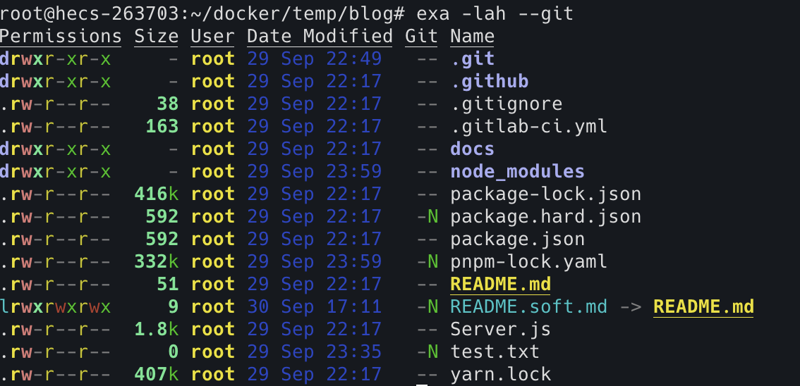
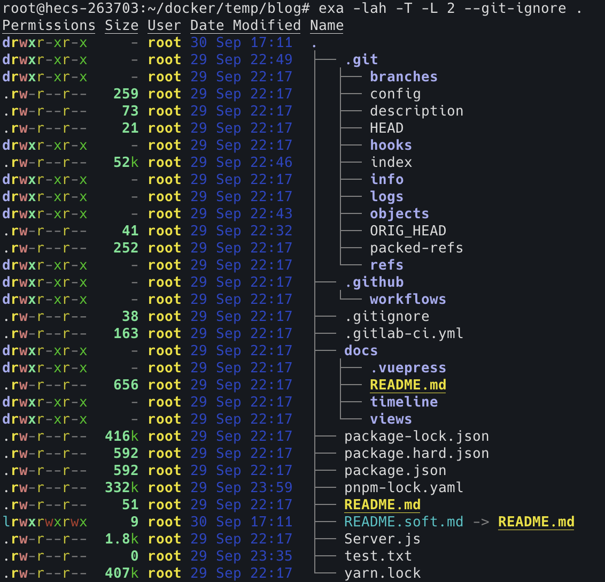

## 总结
1. 跳转当前目录下的文件，或跳转父级可以使用 `cd`，其他情况下可以使用 `autojump` 的 `j` 替代。
2. 使用 `exa` 替代 `ls` 和 `tree`。


<!-- ## 疑问
- [ ]  -->


## 提问
- [x] 在 ls 单指令列出文件列表时为何不显示 `.git` 目录，应如何显示
  `ls -a`
- [x] 使用 tree/exa 列出目录树时，如何忽略 `.gitignore` 中文件内容
  - `tree -lah -L 2 --gitignore`       
  - `exa -lah -L 2 -T --git-ignore`     
- [x] 在 Node.js 或其它语言中如何获得 `pwd`
  `process.cwd()`
- [x] 在 Node.js 或其它语言中如何获得 `ls` 子文件列表。
  - [fsp.readdir](https://nodejs.org/api/fs.html#fspromisesreaddirpath-options): Node.js 
  - [readdir](https://man7.org/linux/man-pages/man3/readdir.3.html): linux 编程


## 1. 前提提要、场景
一般服务器的 linux 系统，不像 window 一样可视化界面，需要靠命令切换当前工作目录，以及查询目录下的文件。       


## 2. cd
`cd`: `change directory` 切换当前工作目录，使用方法        
`cd <directoryName>`

还有一下特殊目录
- `.`: 当前工作目录
- `..`: 父级工作目录
- `/`: 根目录
- `~`: 当前的用户目录，创建用户时可设置。等价于环境变量 `$HOME`。
- `-`: 进入上一次的工作目录


### 2.1 autojump
一个超级便捷，用于切换当前工作目录的小工具 [autojump](https://github.com/wting/autojump/blob/master/bin/autojump.bash)，

访问过的目录会根据权重记录，使用 `j <directoryName>` 自动补全跳转。


## 3. pwd
`pwd`: `print working directory` 打印当前工作目录
```bash
$ pwd
/home/train
```


## 4. ls
`ls`: 列出某个工作目录的内容       
`ls` 默认不列出 `.` 开头的文件，如 `.git`、 `.babelrc`、`.eslintrc` 均不会显示。使用 `-a`，将会把所有文件列出，包含了 `.` 、 `..`。使用 `-A` 将不会列出 `.` 、 `..`      

日常使用 `ls -lah` 列出文件信息
```bash
# -l: 使用长列表格式
# -a: 列出所有文件，包括以 . 开头的文件
# -h: 以可读的形式表示文件体积，比如 100M
$ ls -lah
total 48K
drwxrwxr-x  6 train train 4.0K Sep 24 16:31 .
drwxrwxrwx 58 train train 4.0K Oct  8 18:05 ..
-rw-r--r--  1 train train    0 Sep 12 23:04 .env
-rw-------  1 train train  16K Sep 12 23:05 acme.json
drwxrwxr-x  7 train train 4.0K Sep 29 20:38 blog
-rw-r--r--  1 train train 1.4K Sep 13 11:02 docker-compose.yml
drwxrwxr-x  2 train train 4.0K Sep 24 16:31 envsubst
drwxr-xr-x  2 root  root  4.0K Sep 12 11:07 log
-rw-r--r--  1 train train 2.9K Sep 12 22:59 traefik.toml
drwxr-xr-x  2 train train 4.0K Sep 12 10:40 whoami
```


## 5. exa
更高级的命令，用来替代 `ls`， 拥有更友好的色彩更丰富的输出，支持更丰富的选项。       
`exa -lah --git`      
`--git`: 支持查看 git 情况
- M: 修改文件
- N: 新文件
- I: 忽略文件




树状形式展示文件
```bash
# -T: --tree，以树状图的形式列出文件
# -L: --level，指定层级
# --git-ignore: 忽略 .gitignore 内指定的文件
$ exa -lah -T -L 2 --git-ignore .
```



## 6. tree
树状形式展示文件
```bash
# -F: 对目录末尾添加 /，对可执行文件末尾添加 *
# -L: 指定层级
# --gitignore: 忽略 .gitignore 内指定的文件
$ tree -lah -L 2 --gitignore .
```


> 在 Debian 中安装最新的 `tree` ，没有 `--gitignore` 指令，在 mac 中有，所以还是用 `exa` 吧 省心还好看。


个人github：[**https://github.com/zhengjiabo**](https://github.com/zhengjiabo) 