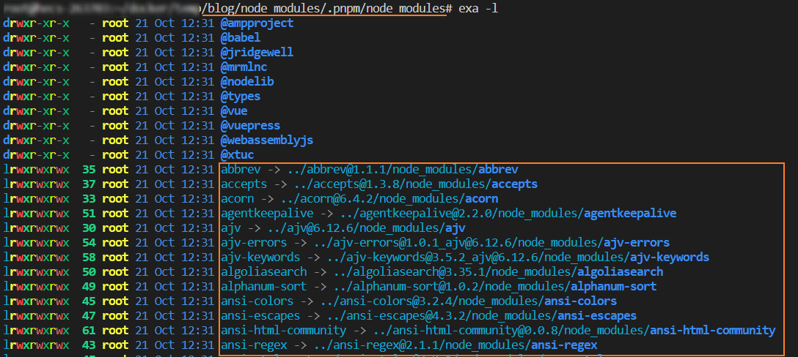

## 总结
- Linux 文件系统中可以理解为默认都是硬链接，所以没有源文件和硬链接的区分，本质都是指向文件 Inode 的指针。只有软件需要区分源文件和软链接。
- 硬链接特点：
  - 具有相同的 Inode，Size 等元属性
  - 删除硬链接文件或者删除源文件任意之一，文件实体并未被删除，这个特点可以防止重要文件被误删。
- 软链接特点：
  - 不同的 Inode，Size 等元属性，证明是两个独立的文件。
  - Size：是指向的源文件名称长度，例如这里 `test.yaml` 9 个字节。


## 提问
- [x] 1. 如何找到文件的所有的硬链接位置
    > `find -samefile <filename>`      
    `find -L -samefile <filename>` 包括软硬链接
- [x] 2. 软链接文件的文件大小是如何得到的
    > 指向的源文件名称长度-字节
- [x] 3. npm link 的工作原理是什么
    > package 源代码中执行 `npm link`，会在全局路径里创建以源代码 `package.json` 的 `name` 字段命名的软连接，链接到源代码目录。     
    后续在调试项目中执行 `npm link <packageName>`，将会替换 `nodemodules/<packageName>` 为软链接，链接到全局路径中 `<packageName>`。经过两个软链接，这样就可以到源代码项目中调试了。    
- [ ] 4. 在 pnpm 中，为什么不全部使用软链接
    > [为什么使用硬链接-为什么不直接创建到全局存储的符号链接](https://pnpm.io/zh/faq#%E4%B8%BA%E4%BB%80%E4%B9%88%E4%BD%BF%E7%94%A8%E7%A1%AC%E9%93%BE%E6%8E%A5-%E4%B8%BA%E4%BB%80%E4%B9%88%E4%B8%8D%E7%9B%B4%E6%8E%A5%E5%88%9B%E5%BB%BA%E5%88%B0%E5%85%A8%E5%B1%80%E5%AD%98%E5%82%A8%E7%9A%84%E7%AC%A6%E5%8F%B7%E9%93%BE%E6%8E%A5) 
    
    > 直接软链至全局存储与 Node 的 --preserve-symlinks 标志一起使用是可行的，但是，该方法附带了个自己的问题。
    [Note, however, that using --preserve-symlinks can have other side effects. Specifically, symbolically linked native modules can fail to load if those are linked from more than one location in the dependency tree (Node.js would see those as two separate modules and would attempt to load the module multiple times, causing an exception to be thrown)](https://nodejs.org/api/cli.html#--preserve-symlinks).    
    还未总结
- [x] 5. 在 Node.js 或其它语言中如何执行 ln
    > 软链接 [fs.symlinkSync(target, path[, type])](https://nodejs.org/api/fs.html#fssymlinksynctarget-path-type)    
    硬链接 [fs.link(existingPath, newPath, callback)](https://nodejs.org/api/fs.html#fslinkexistingpath-newpath-callback)


## 疑问
- [ ] 1. pnpm 解决了解决软链接循环引用[avoid circular symlinks](https://www.pnpm.cn/symlinked-node-modules-structure)，文中的循环引用的场景是指自己引用自己吗


## 1. 前提提要、场景
为解决文件的共享使用，Linux 系统引入了两种链接。      
- 硬链接（Hard Link）：一个指向文件 Inode 的指针。硬链接文件与原始文件其实是同一个文件，只是不同的名字。删除了原始文件，硬链接文件依然指向文件。
- 软链接（符号链接 Symbolic Link）：类似 window 的快捷方式。删除了原始文件，会使软链接失效。


## 2. ln \<sourceFile\> \<hardFile\> 创建硬链接
`ln <sourceFile> <hardFile>`默认使用即可创建硬链接
```bash
# 创建一个硬链接 test.hard.yaml
$ ln test.yaml test.hard.yaml

# 此时 stat 查看 test.yaml，其 Links 为 2
$ stat test.yaml
  File: test.yaml
  Size: 0               Blocks: 0          IO Block: 4096   regular empty file
Device: fd01h/64769d    Inode: 1109726     Links: 2
Access: (0664/-rw-rw-r--)  Uid: ( 1001/   train)   Gid: ( 1001/   train)
Access: 2022-10-20 20:32:46.776692432 +0800
Modify: 2022-10-20 20:32:46.776692432 +0800
Change: 2022-10-20 20:33:46.946778309 +0800
 Birth: 2022-10-20 20:32:46.775692414 +0800


# 此时 stat 查看 test.hard.yaml，其 Links 为 2，与源文件具有相同的 Inode
$ stat test.hard.yaml
  File: test.hard.yaml
  Size: 0               Blocks: 0          IO Block: 4096   regular empty file
Device: fd01h/64769d    Inode: 1109726     Links: 2
Access: (0664/-rw-rw-r--)  Uid: ( 1001/   train)   Gid: ( 1001/   train)
Access: 2022-10-20 20:32:46.776692432 +0800
Modify: 2022-10-20 20:32:46.776692432 +0800
Change: 2022-10-20 20:33:46.946778309 +0800
 Birth: 2022-10-20 20:32:46.775692414 +0800
```

硬链接特点：具有相同的 Inode，Size 等元属性


使用包管理工具 `pnpm`，可以看到许多硬链接。


## 3. ln -s \<sourceFile\> \<softFile\> 创建软链接
```bash
# 创建一个硬链接 test.soft.yaml
$ ln -s test.yaml test.soft.yaml

# 此时 stat 查看 test.yaml，其 Links 还是为 2，软链接不增加 Links
$ stat test.yaml
  File: test.yaml
  Size: 0               Blocks: 0          IO Block: 4096   regular empty file
Device: fd01h/64769d    Inode: 1109726     Links: 2
Access: (0664/-rw-rw-r--)  Uid: ( 1001/   train)   Gid: ( 1001/   train)
Access: 2022-10-20 20:32:46.776692432 +0800
Modify: 2022-10-20 20:32:46.776692432 +0800
Change: 2022-10-20 20:33:46.946778309 +0800
 Birth: 2022-10-20 20:32:46.775692414 +0800

# 此时 stat 查看 test.soft.yaml，其 Links 为 2，与源文件具有相同的 Inode
$ stat test.soft.yaml
  File: test.soft.yaml -> test.yaml
  Size: 9               Blocks: 0          IO Block: 4096   symbolic link
Device: fd01h/64769d    Inode: 1109727     Links: 1
Access: (0777/lrwxrwxrwx)  Uid: ( 1001/   train)   Gid: ( 1001/   train)
Access: 2022-10-20 21:08:18.392154587 +0800
Modify: 2022-10-20 21:08:13.353063649 +0800
Change: 2022-10-20 21:08:13.353063649 +0800
 Birth: 2022-10-20 21:08:13.353063649 +0800
```

软链接特点：
- 不同的 Inode，Size 等元属性，证明是两个独立的文件。
- Size：是指向的源文件名称长度-字节，例如这里 `test.yaml` 9 个字节。


使用包管理工具 `pnpm`，也可以看到许多软链接。


软链接场景：
1. 在前端中，可以使用 `npm link` 为 `node_modules` 中的某个 `package` 创建软链接至源码目录，方便调试。
2. 在前端中，使用 `npm` 安装依赖，`node_modules` 中某个 package `package.json` 中的 `bin` 字段所指向的文件，会软链接形式存放在 `node_modules/.bin` 目录。（`pnpm` 是生成脚本）     
3. 在前端中，`npm i -g` 全局安装，如果是有可执行文件的，会将 package 的 `bin` 字段所指向文件，在 `$PATH` 目录下以软链接形式存在，后续可直接调用。    


## 4. pnpm 中的软硬链接


- 工程直接依赖的包，在 `node_modules` 都是以 **软链接** 形式存在。真实地址在项目中的 `/node_modules/.pnpm`。解决了幽灵依赖（`node_modules` 文件夹没有非工程直接依赖的包）。
  
- 依赖的真实存放位置：`/node_modules/.pnpm/<name>@<version>/node_modules/<name>`。以平铺的形式存在，且所有包（深层级的依赖）都是这种短路径。解决了 `npm v2` 的嵌套 `node_modules` 引起长路径问题，也保留了包之间的相互隔离。
- `/node_modules/.pnpm` 文件夹下的依赖都是从全局的依赖 `.pnpm store`**硬链接** 出来。例如 `/node_modules/.pnpm/<name>@<version>/node_modules/<name>` 目录下的文件就是硬链接。这样解决了文件资源重复问题（节省磁盘空间，节省下载时间）。而且由于硬链接，即使全局的依赖被删除，项目的依赖也不会受影响。
  > 可以查项目依赖中任意硬链接所有引用的位置，例如以下示例，项目使用了 `vue`，其 `package.json` 的 `main` 字段为：`vue.runtime.common.js`
  ```bash
    # 查找所有硬链接路径
    # -samefile：查询所有硬链接路径
    $ find / -samefile /node_modules/.pnpm/vue@2.7.10/node_modules/vue/dist/vue.runtime.common.js
    /root/docker/temp/blog/node_modules/.pnpm/vue@2.7.10/node_modules/vue/dist/vue.runtime.common.js
    /opt/share/pnpm/.pnpm-store/v3/files/c3/462c0dfe7173c5e1a3685b337963087b5fb19f269dbb86298e31c3911413a1c48b6154b2c9e4dce4b6df4683328e252f5c85a5dafdee9b16d7596c38395cf7
    # 第二个地址 /opt/share/pnpm/... 就是我全局 pnpm 仓库的地址，全局缓存
  ```

- 依赖真实的路径为 `/node_modules/.pnpm/<name>@<version>/node_modules/<name>`，其所需要的依赖（包含了非工程直接依赖的包），也都是存放在与其同级的文件夹中 `/node_modules/.pnpm/<name>@<version>/node_modules/`，且软链接形式存在，软链接到 `.pnpm/<name>@<version>` 。 
  这是为了允许他们`require(<selfName>)` 引用自身（因为自身也在`node_modules` 中），且解决软链接循环引用。
  > `require()` 寻找依赖包，是一层一层目录往外找的。所以对于 `node` 而言，依赖关系是在包的 `node_module` 中还是在父/祖父目录中的任何 `node_module` 中都没有区别。具体可以参考文档：[Node.js Manual & Documentation - Modules
  If it is not found there, then it moves to the parent directory, and so on, until either the module is found, or the root of the tree is reached.](https://nodejs.org/docs/v0.4.2/api/modules.html)     
  而且 `require` 时遇到软链接，会使用模块的“实际路径”作为标识符和根路径来定位其他依赖模块。 [By default, when Node.js loads a module from a path that is symbolically linked to a different on-disk location, Node.js will dereference the link and use the actual on-disk "real path" of the module as both an identifier and as a root path to locate other dependency modules.](https://nodejs.org/api/cli.html#--preserve-symlinks)

- `pnpm v5` 将创建一个“半严格”的 `node_modules`。项目将只能导入 `package.json` 中声明的直接依赖包，而依赖包能访问任何其他的包。[pnpm的node_modules配置选项](https://pnpm.io/zh/blog/2020/10/17/node-modules-configuration-options-with-pnpm)，`pnpm` 将所有包，软链接一份放在了 `/node_modules/.pnpm/node_modules` 下，这样就解决了依赖包找不到依赖包的问题。
  > 理论上依赖包的依赖是可以在其本身 `node_modules` 中匹配到，但不排除有些依赖使用幽灵依赖，或者利用原本 `node require()` 的特性使用的也不是依赖的依赖，而是同级别的依赖，所以就出现了这种场景。
  `pnpm` 为了覆盖这种场景，就诞生了`/node_modules/.pnpm/node_modules/` 如果匹配不到，直至 `/node_modules/.pnpm` 这个层级，就会查找 `/node_modules/.pnpm/node_modules`，便能找到引用的依赖包。

- 如果依赖的依赖只有一组依赖项，将会以 `.pnpm/<name>@<version>` 形式存在。如果依赖的依赖有不同版本，即不同的依赖项集，将会以 `.pnpm/<name>@<version>_<subname>@<version>` 形式存在，在后面追加不同的依赖项版本做为唯一标志名（不同的依赖项可能是来自于子孙依赖)。      
  至于做为引用他们依赖的父依赖（有点绕，就这么称呼了），将会在他们自己的 `node_modules` 中软链接到正确的依赖上，以确保使用到正确的版本。
  > 
  >  
  > 留意图片的两个点
  >  1. 对于依赖本身而言，`anymatch@2.0.0_supports-color` 和 `anymatch@2.0.0` 下的 `anymatch` 都是同个文件硬链接出来的。不同的只是其子依赖
  >  2. `.pnpm/<name>@<version>_<subname>@<version>` 后面追加不同的依赖项版本做为唯一标志名，不同的依赖项可能是来自于子孙依赖（这种场景是子依赖版本一致，但子孙依赖版本不一致）