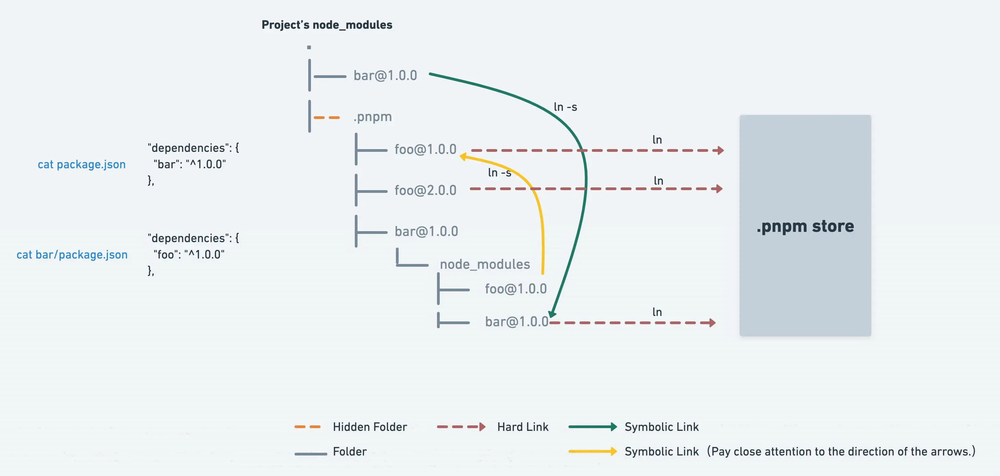

## 总结
- Linux 文件系统中可以理解为默认都是硬链接，所以没有源文件和硬链接的区分，本质都是指向文件 Inode 的指针。只有软件需要区分源文件和软链接。
- 硬链接特点：
  - 具有相同的 Inode，Size 等元属性
  - 删除硬链接文件或者删除源文件任意之一，文件实体并未被删除，这个特点可以防止重要文件被误删。
- 软链接特点：
  - 不同的 Inode，Size 等元属性，证明是两个独立的文件。
  - Size：是指向的源文件名称长度，例如这里 `test.yaml` 9 个字节。


## 提问
- [x] 1. 如何找到文件的所以要硬链接位置
    > `find -samefile <filename>`      
    `find -L -samefile <filename>` 包括软硬链接
- [x] 2. 软链接文件的文件大小是如何得到的
    > 指向的源文件名称长度-字节
- [x] 3. npm link 的工作原理是什么
    > package 源代码中执行 `npm link`，会在全局路径里创建以源代码 `package.json` 的 `name` 字段命名的软连接，链接到源代码目录。     
    后续在调试项目中执行 `npm link <packageName>`，将会替换 `nodemodules/<packageName>` 为软链接，链接到全局路径中 `<packageName>`。经过两个软链接，这样就可以到源代码项目中调试了。    
- [ ] 4. 在 pnpm 中，为什么不全部使用软链接
    > [为什么使用硬链接-为什么不直接创建到全局存储的符号链接](https://pnpm.io/zh/faq#%E4%B8%BA%E4%BB%80%E4%B9%88%E4%BD%BF%E7%94%A8%E7%A1%AC%E9%93%BE%E6%8E%A5-%E4%B8%BA%E4%BB%80%E4%B9%88%E4%B8%8D%E7%9B%B4%E6%8E%A5%E5%88%9B%E5%BB%BA%E5%88%B0%E5%85%A8%E5%B1%80%E5%AD%98%E5%82%A8%E7%9A%84%E7%AC%A6%E5%8F%B7%E9%93%BE%E6%8E%A5)     
    还未总结
- [x] 5. 在 Node.js 或其它语言中如何执行 ln
    > 软链接 [fs.symlinkSync(target, path[, type])](https://nodejs.org/api/fs.html#fssymlinksynctarget-path-type)    
    硬链接 [fs.link(existingPath, newPath, callback)](https://nodejs.org/api/fs.html#fslinkexistingpath-newpath-callback)


## 1. 前提提要、场景
为解决文件的共享使用，Linux 系统引入了两种链接。      
- 硬链接（Hard Link）：一个指向文件 Inode 的指针。硬链接文件与原始文件其实是同一个文件，只是不同的名字。删除了原始文件，硬链接文件依然指向文件。
- 软链接（符号链接 Symbolic Link）：类似 window 的快捷方式。删除了原始文件，会使软链接失效。


## 2. ln \<sourceFile\> \<hardFile\> 创建硬链接
`ln <sourceFile> <hardFile>`默认使用即可创建硬链接
```bash
# 创建一个硬链接 test.hard.yaml
$ ln test.yaml test.hard.yaml

# 此时 stat 查看 test.yaml，其 Links 为 2
$ stat test.yaml
  File: test.yaml
  Size: 0               Blocks: 0          IO Block: 4096   regular empty file
Device: fd01h/64769d    Inode: 1109726     Links: 2
Access: (0664/-rw-rw-r--)  Uid: ( 1001/   train)   Gid: ( 1001/   train)
Access: 2022-10-20 20:32:46.776692432 +0800
Modify: 2022-10-20 20:32:46.776692432 +0800
Change: 2022-10-20 20:33:46.946778309 +0800
 Birth: 2022-10-20 20:32:46.775692414 +0800


# 此时 stat 查看 test.hard.yaml，其 Links 为 2，与源文件具有相同的 Inode
$ stat test.hard.yaml
  File: test.hard.yaml
  Size: 0               Blocks: 0          IO Block: 4096   regular empty file
Device: fd01h/64769d    Inode: 1109726     Links: 2
Access: (0664/-rw-rw-r--)  Uid: ( 1001/   train)   Gid: ( 1001/   train)
Access: 2022-10-20 20:32:46.776692432 +0800
Modify: 2022-10-20 20:32:46.776692432 +0800
Change: 2022-10-20 20:33:46.946778309 +0800
 Birth: 2022-10-20 20:32:46.775692414 +0800
```

硬链接特点：具有相同的 Inode，Size 等元属性


使用包管理工具 `pnpm`，可以看到许多硬链接。


## 3. ln -s \<sourceFile\> \<softFile\> 创建软链接
```bash
# 创建一个硬链接 test.soft.yaml
$ ln -s test.yaml test.soft.yaml

# 此时 stat 查看 test.yaml，其 Links 还是为 2，软链接不增加 Links
$ stat test.yaml
  File: test.yaml
  Size: 0               Blocks: 0          IO Block: 4096   regular empty file
Device: fd01h/64769d    Inode: 1109726     Links: 2
Access: (0664/-rw-rw-r--)  Uid: ( 1001/   train)   Gid: ( 1001/   train)
Access: 2022-10-20 20:32:46.776692432 +0800
Modify: 2022-10-20 20:32:46.776692432 +0800
Change: 2022-10-20 20:33:46.946778309 +0800
 Birth: 2022-10-20 20:32:46.775692414 +0800

# 此时 stat 查看 test.soft.yaml，其 Links 为 2，与源文件具有相同的 Inode
$ stat test.soft.yaml
  File: test.soft.yaml -> test.yaml
  Size: 9               Blocks: 0          IO Block: 4096   symbolic link
Device: fd01h/64769d    Inode: 1109727     Links: 1
Access: (0777/lrwxrwxrwx)  Uid: ( 1001/   train)   Gid: ( 1001/   train)
Access: 2022-10-20 21:08:18.392154587 +0800
Modify: 2022-10-20 21:08:13.353063649 +0800
Change: 2022-10-20 21:08:13.353063649 +0800
 Birth: 2022-10-20 21:08:13.353063649 +0800
```

软链接特点：
- 不同的 Inode，Size 等元属性，证明是两个独立的文件。
- Size：是指向的源文件名称长度-字节，例如这里 `test.yaml` 9 个字节。


使用包管理工具 `pnpm`，也可以看到许多软链接。


软链接场景：
1. 在前端中，可以使用 `npm link` 为 `node_modules` 中的某个 `package` 创建软链接至源码目录，方便调试。
2. 在前端中，使用 `npm` 安装依赖，`node_modules` 中某个 package `package.json` 中的 `bin` 字段所指向的文件，会软连接至 `node_modules/.bin` 目录。（`pnpm` 是生成脚本）
3. 在前端中，`npm i -g` 将某个 package 的 `bin` 字段所指向文件，软连接到  `$PATH` 目录下


## 4. pnpm 中的软硬链接


- 项目中的其它依赖，都是软链接指向项目中的 `.pnpm` 依赖
- 项目中的 `.pnpm` 依赖都是硬链接到全局的依赖 `.pnpm store`。这样即使全局的依赖被删除，项目的依赖也不会被影响。


