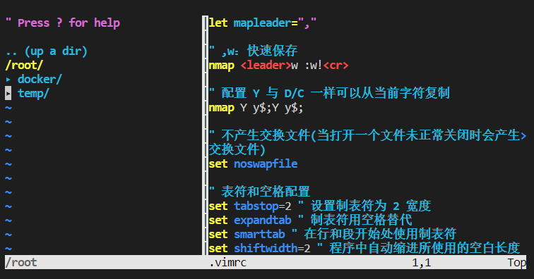

## 总结
-  


## 提问
- [x] 


## 1. 前提提要、场景

通过之前的章节，已经可以使用 `vim` 进行编写文件了。但距离真正的开发还差了些便捷，可以装些插件来提高开发效率。


## 2. pathogen 管理插件 

[pathogen github](https://github.com/tpope/vim-pathogen)    

新建文件夹，并将后续插件都放于该文件夹中。
```bash
$ mkdir -p ~/.vim-config/plugins && \
curl -LSso ~/.vim-config/plugins https://tpo.pe/pathogen.vim
```

配置 `vim` 插件路径为 `~/.vim-config/plugins/`，后续将插件下载在该目录。由于是自定义目录，不是 `vim-pathogen` 默认的目录，所以根据 `github` 上的说明。

在 `.vimrc` 中配置
```bash
" 配置 runtimepath
source ~/.vim-config/plugins/vim-pathogen/pathogen.vim

execute pathogen#infect('plugins/{}', '~/.vim-config/plugins/{}')
execute pathogen#helptags()
```


## 3. nerdtree 文件目录管理器

[nerdtree github](https://github.com/preservim/nerdtree)    
文件目录管理器，跟 vscode 的目录一样。      

将插件下载到上一步设置的自定义目录 `~/.vim-config/plugins/nerdtree` 中
```bash
# depth：1 只保留最近一次 commit 记录，轻量级 clone
$ git clone --depth=1 https://github.com/preservim/nerdtree.git ~/.vim-config/plugins/nerdtree
```

在 `.vimrc` 中配置
```bash
syntax on
filetype plugin indent on
```

随后使用 `vim` 打开任意文件，键入 `:NERDTree<CR>`，`<CR>` 为回车，便能看到以下界面




也可以设置快捷键，在 `.vimrc` 中配置
```bash
nnoremap <leader>n :NERDTreeFocus<CR>
nnoremap <C-n> :NERDTree<CR>
nnoremap <C-t> :NERDTreeToggle<CR>
nnoremap <C-f> :NERDTreeFind<CR> " 定位当前文件的位置
```
在文件管理窗口
- `ma`: 新建文件或文件夹
- `md`: 删除文件或文件夹
- `I`: 切换隐藏文件显示状态
- `i`: 打开文件，水平面板打开
- `s`: 打开文件，垂直面板打开


## 4. ctrlp 文件搜索

[ctrlp github](https://github.com/ctrlpvim/ctrlp.vim)    
文件搜索，类似于 vscode 的 `ctrl + p`


将插件下载到上一步设置的自定义目录 `~/.vim-config/plugins/ctrlp` 中
```bash
# depth：1 只保留最近一次 commit 记录，轻量级 clone
$ git clone --depth=1 https://github.com/ctrlpvim/ctrlp.vim.git  ~/.vim-config/plugins/ctrlp
```


在 `.vimrc` 中配置
```bash
" ctrlp
let g:ctrlp_map = '<c-p>'
let g:ctrlp_cmd = 'CtrlP'
let g:ctrlp_working_path_mode = 'ra'
let g:ctrlp_root_markers = ['pom.xml', '.p4ignore']
set wildignore+=*/tmp/*,*.so,*.swp,*.zip     " MacOSX/Linux
let g:ctrlp_custom_ignore = '\v[\/]\.(git|hg|svn)$'
let g:ctrlp_user_command = 'find %s -type f'        " MacOSX/Linux
let g:ctrlp_user_command = ['.git', 'cd %s && git ls-files -co --exclude-standard']
```
`ctrlp`，类似于 vscode 的 `<Ctrl-p>`
- `<c-p>`: 在当前项目下查找文件
- `,b`: 在buffer中查找文件
- `,f`: 在最近打开文件中查找     

在 `ctrlp` 窗口中，`<c-j>` 和 `<c-k>` 控制上下移动。

