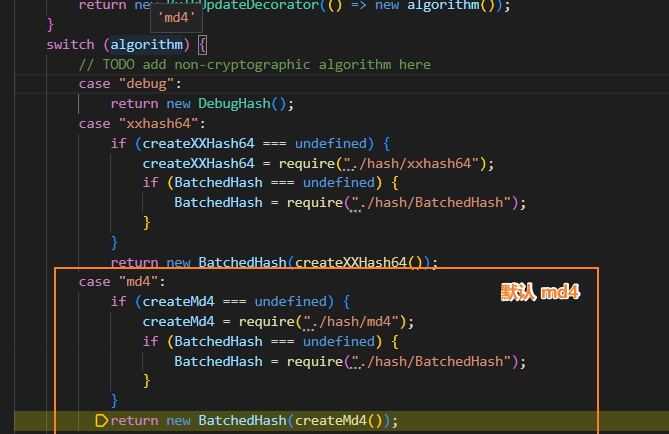

## 总结
选择一个更加快速的 hash 函数，即可减少 CPU 消耗，并提升打包速度。比如将默认的 `md4` 换成 `xxhash64`。    
先抛出结论：1GB 资源 `xxhash64` 用时 161ms，`md4` 用时 1.6s，快了接近 10 倍。        
也尝试了多种 `hash` 算法，以下是 1GB 写满 1 的文本资源，也尝试过随机文本，结果差不多，各个 `hash` 算法的排序，
```bash
webpack_xxhash64: 161.71ms              # webpack 的 xxhash64
RSA-SHA1: 990.429ms
sha1WithRSAEncryption: 998.56ms
RSA-SHA1-2: 1.006s
ssl3-sha1: 1.043s
sha1: 1.087s
md4: 1.193s
md4WithRSAEncryption: 1.211s
RSA-MD4: 1.214s
ssl3-md5: 1.412s
blake2b512: 1.426s
sha384: 1.426s
RSA-SHA512: 1.449s
RSA-SHA384: 1.451s
sha512-224WithRSAEncryption: 1.467s
sha512-224: 1.471s
sha512-256: 1.479s
RSA-MD5: 1.488s
sha512-256WithRSAEncryption: 1.494s
sha512: 1.505s
sha512WithRSAEncryption: 1.509s
sha384WithRSAEncryption: 1.522s
RSA-SHA512/224: 1.529s
RSA-SHA512/256: 1.543s
md5: 1.547s
webpack_md4: 1.618s                    # webpack 的 md4
md5WithRSAEncryption: 1.862s
sha224WithRSAEncryption: 2.137s
RSA-SHA256: 2.177s
RSA-SHA224: 2.227s
sha256: 2.233s
shake128: 2.250s
blake2s256: 2.282s
sha224: 2.382s
md5-sha1: 2.456s
RSA-SHA3-224: 2.481s
sha256WithRSAEncryption: 2.533s
id-rsassa-pkcs1-v1_5-with-sha3-224: 2.556s
sha3-224: 2.581s
sha3-256: 2.641s
id-rsassa-pkcs1-v1_5-with-sha3-256: 2.663s
shake256: 2.680s
RSA-SHA3-256: 2.688s
RSA-SHA3-384: 3.460s
sha3-384: 3.515s
id-rsassa-pkcs1-v1_5-with-sha3-384: 3.516s
RSA-SM3: 4.139s
sm3WithRSAEncryption: 4.140s
sm3: 4.279s
ripemd: 4.603s
ripemd160WithRSA: 4.639s
RSA-RIPEMD160: 4.648s
rmd160: 4.715s
ripemd160: 4.955s
sha3-512: 4.960s
id-rsassa-pkcs1-v1_5-with-sha3-512: 4.969s
RSA-SHA3-512: 5.049s
whirlpool: 5.466s
mdc2WithRSA: 48.835s
RSA-MDC2: 49.275s
mdc2: 53.637s
```

以下是 hash 算法，测试代码。内含排序
```javascript
function main () {
    const crypto = require('node:crypto');
    const createHash = require("webpack/lib/util/createHash");
    const webpack_md4 = createHash('md4')
    const webpack_xxhash64 =  createHash('xxhash64')

    /* 
        参考webpack 中的源代码 
        \node_modules\webpack-sources\lib\RawSource.js

        if (this._valueAsBuffer === undefined) {
            this._valueAsBuffer = Buffer.from(this._value, "utf-8");
        }
        hash.update("RawSource");
        hash.update(this._valueAsBuffer); 
    */


    // 思路：模拟 webpack 的实现，取出文件文本后变成二进制交给 hash 算法
    // 目的是取一个大的文本数据，去测试各个 hash 算法性能

    const SIZE = 1024 * 1024 * 1024  // 1 GB，内存够的勇者可以往上加。
    const buf = Buffer.alloc(SIZE, '1', "utf-8")

    const hashArr = crypto.getHashes().map(hashName => ({hashName, hash: crypto.createHash(hashName)})) // 取得所有 hash 算法
    hashArr.push({hashName: 'webpack_md4', hash: webpack_md4}, {hashName: 'webpack_xxhash64', hash: webpack_xxhash64}) // 推入 webpack 自带的

    for (item of hashArr) { 
        const { hashName, hash } = item

        console.time(hashName)
        hash.update("RawSource");
        hash.update(buf);
        hash.digest('hex') // 取 16 进制摘要
        console.timeEnd(hashName)
        
        item.hash = null
    }
}

main()


// console 输出的文本扔里面排序
function sort (str) {
    const arr = str.split('\n').filter(str => str)
    const getMs = str => {
        const result = str.match(/:\s([\d\.]+)(m?s)/)
        return result[1] * (result[2] === 's'? 1000 : 1)
    }
    arr.sort((a, b) =>  getMs(a) - getMs(b))
    console.log(arr.join('\n'))
}

// sort(`
// webpack_md4: 1.618s
// webpack_xxhash64: 161.71ms`)

```

## 提问
- [x] 什么是 Long Term Cache，有何作用？
长期缓存，即强缓存。可大幅度提高客户端的缓存能力，从而大幅度提高二次加载性能。          
    
- [x] 为什么配置 output.filename 时不建议注入版本号？       
会降低客户端缓存能力，发布后客户端第一次加载会因无法命中缓存从而加载性能降低。            
每次版本迭代并不是所有资源都涉及变更，加入版本后打包后，所有资源都会与之前的路径不同。因为路径不同导致无法命中缓存，从而需要向服务器重新请求资源。

- [x] 为什么可以配置 Long Term Cache？  
一般非 hash 资源设置策略缓存，hash 资源设置强缓存。         
hash 资源可以设置强缓存的原因：只要资源内容更新，hash 会发生变化更改请求路径，从而获取到新资源，设置强缓存不会阻碍到版本迭代。至于旧路径的资源仍然保留在客户端的缓存中，只是不会访问到而已。占了点空间没其它副作用，换回的好处是大大提高了用户的体验，利大于弊。               

- [x] 如何提升 webpack 编译时期计算 hash 的速度。    
使用 `xxhash64` 替代 `md4` hash 算法。    

- [x] 在 Node.js 中如何进行 hash 计算
  ```javascript
  const {
    createHash
  } = await import('node:crypto');

  const hash = createHash('sha256');

  hash.update('some data to hash');
  console.log(hash.digest('hex'));
  ```


## 1. 前提提要、场景
使用 `webpack` 打包时，我们总能看到一些带有 hash 的文件，例如以下配置
```javascript
{
  output: {
    filename: `${package.version}.{hash}.js`
  }
}
```
有了 hash 使得资源内容有变化，路径便会更改。从而我们能够利用强缓存，大幅度提高二次加载性能。


应不应该将版能否将版本写到文件名，例如以下配置
```javascript
const package = require('./package.json')

const config = {
  output: {
    filename: `${package.version}.{hash}.js`
  }
}
```

不应该，会降低客户端缓存能力，发布后客户端第一次加载会因无法命中缓存从而加载性能降低。            
每次版本迭代并不是所有资源都涉及变更，加入版本后打包后，所有资源都会与之前的路径不同。因为路径不同导致无法命中缓存，从而需要向服务器重新请求资源


## 3. hash 是如何生成的
在 `webpack` 中，默认使用 `md4` hash 函数，它将基于模块内容以及一系列元信息生成摘要信息。       
对于 hash 算法的一部分代码可参考 [NormalModule](https://github.com/webpack/webpack/blob/main/lib/NormalModule.js) 的 hash 函数。     
我们也可通过以下两个地方调试了解如何生成 hash       
`\node_modules\webpack\lib\util\createHash.js`       
         

`\node_modules\webpack\lib\NormalModule.js`      
         


选择一个更加快速的 hash 函数，即可减少 CPU 消耗，并提升打包速度。比如将默认的 `md4` 换成 `xxhash64`。     

在 webpack 中，可通过 `output.hashFuction` 来配置 hash 函数。[output.hashFunction 官方文档](https://webpack.js.org/configuration/output/#outputhashfunction)


## 疑问
- [x] 


个人github：[**https://github.com/zhengjiabo**](https://github.com/zhengjiabo) 